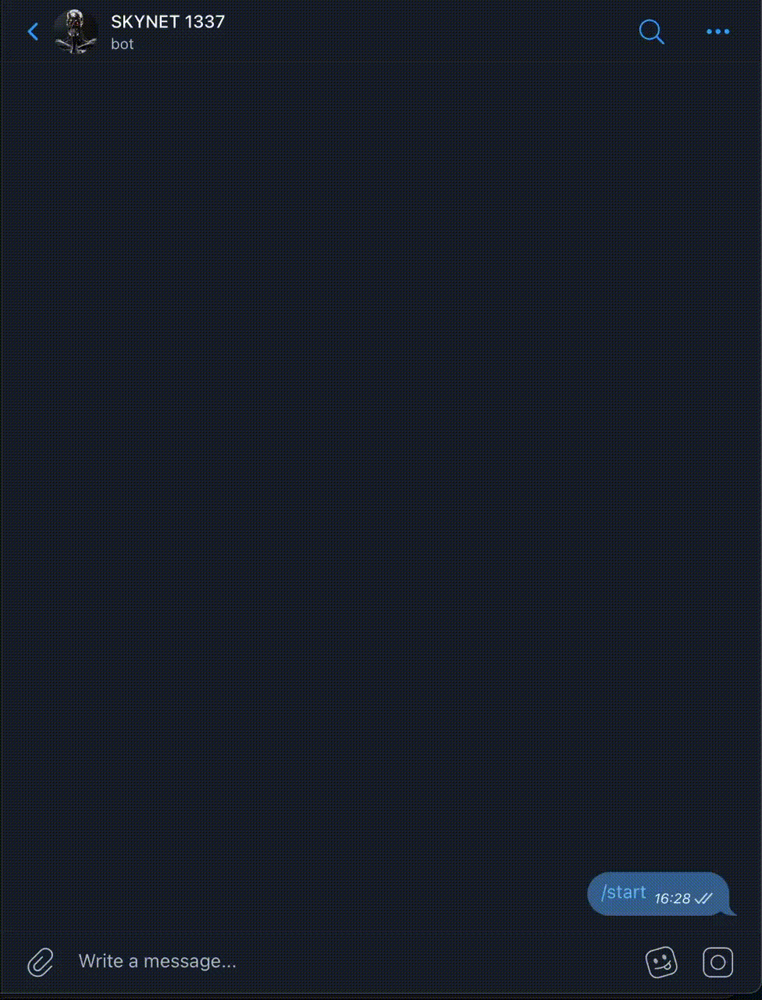

# Botcleaner

Telegram bot for removing duplicate forwarded message from channels.

### Demo

I use a personal chat in the demo, but the bot also works for group chat when different people forward same messages.



## Installation

```bash
 make build-img
 ```

## Usage

1. Configuration

    ```bash
    cp env-example .env
    # fill in variables in .env
    ```

2. Start

    ```bash
    make run-img
    ```

## Contributing

Pull requests are welcome. For major changes, please open an issue first to discuss what you would like to change.

## License

This project is licensed under the MIT License.